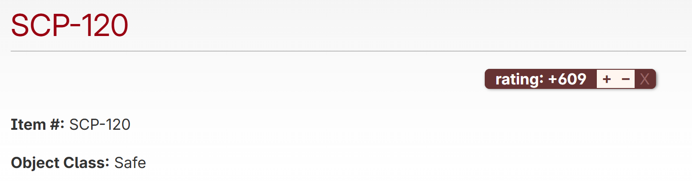
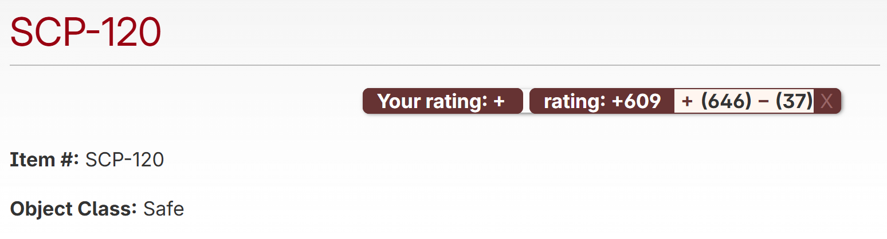

# user-scripts
My browser user-scripts

## SCP-Wiki_-_Show_My_Rating.js

This script will display your rating on [SCP-Wiki](https://scp-wiki.wikidot.com/) pages, along with the number of positive and negative votes.

__Default ratings box__

__Ratings box with this script__

## Sendungverpasst_-_Search_Filter.js

Adds a collapsible filter UI on https://www.sendungverpasst.de/search pages.

- Filter by title prefixes (hide matching series/starts)
- Filter by channel (e.g. hide KiKA)

## Sendungverpasst_-_Search_Links.js

Adds search engine links on https://www.sendungverpasst.de/content/* pages, placed next to the content title.

- Google: searches for "Titel film" (and appends year if available)
- IMDB: searches for "Titel" (appends year if available)
- Wikipedia DE: searches for "Titel film" (appends year if available)

Year extraction: If the page contains a meta description with the year in the first line, followed by a double line break, the script extracts that 4-digit year (e.g. 1980) and adds it to the search queries. When no year is present, the search falls back to the title-only variant (with "film" for Google/Wikipedia).

